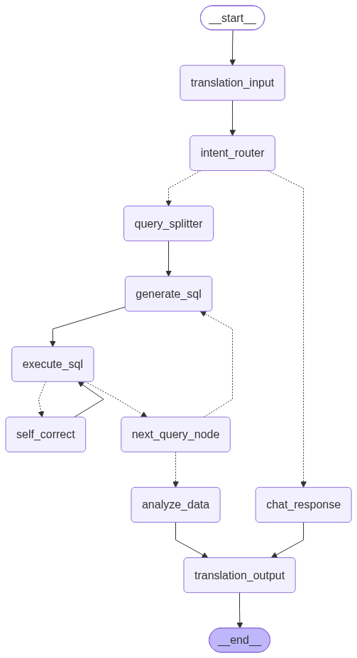

# Aloka Intelligence

Aloka Intelligence is an AI assistant developed for the Karnataka State Police. It provides database query generation, multilingual support, cyber threat analysis, and automated data insights.

## LangGraph Workflow Flowchart

## Overview

The application features a hybrid architecture with two main data pathways:
- Public Intelligence: Handles general inquiries, definitions, and conversational responses.
- Secure Database Records: Converts natural language queries into read-only SQL commands to query local police database records.

## Key Capabilities

- Natural Language to SQL query generation
- Automated SQL error self-correction
- Multilingual translation between Kannada and English
- Cyber threat IP analysis
- Automatic chart generation for aggregated data

## Tech Stack

- Backend: Python, FastAPI, LangGraph, LangChain, Groq LLM, SQLAlchemy, MySQL
- Frontend: React, Vite, TailwindCSS

## Setup Instructions

### Backend Setup

1. Navigate to the backend directory:
   cd backend

2. Create and activate a virtual environment:
   python -m venv .venv
   source .venv/bin/activate

3. Install dependencies:
   pip install -r requirements.txt

4. Configure environment variables in backend/.env file:
   GROQ_API_KEY=your_api_key
   DB_HOST=localhost
   DB_PORT=3306
   DB_USER=root
   DB_PASSWORD=your_password
   DB_NAME=ksp_db

5. Run the backend server:
   uvicorn app.app:app --reload --port 8000

### Frontend Setup

1. Navigate to the frontend directory:
   cd frontend

2. Install dependencies:
   npm install

3. Start the development server:
   npm run dev
